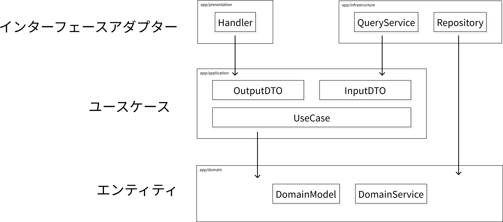

### ディレクトリ構成

```
.
├── app // アプリケーションコード
│   ├── application // ユースケース
│   ├── cli // コマンドライン操作用のツール
│   ├── cmd // アプリケーションのスタート（main.go）
│   ├── config // 各種設定
│   ├── docs // APIドキュメント
│   ├── domain // ビジネスロジックの中核、各種ドメインオブジェクト
│   ├── infrastructure // DBや外部APIへの実装詳細
│   ├── presentation ユーザーへの表示や入力（HTTP等）
│   └── server（HTTPサーバーの設定やルーティング）
├── ops // 各種環境周りに関するファイル
└── pkg // ドメインロジックを持たない汎用的な処理
```

### アプリケーションの構成図


